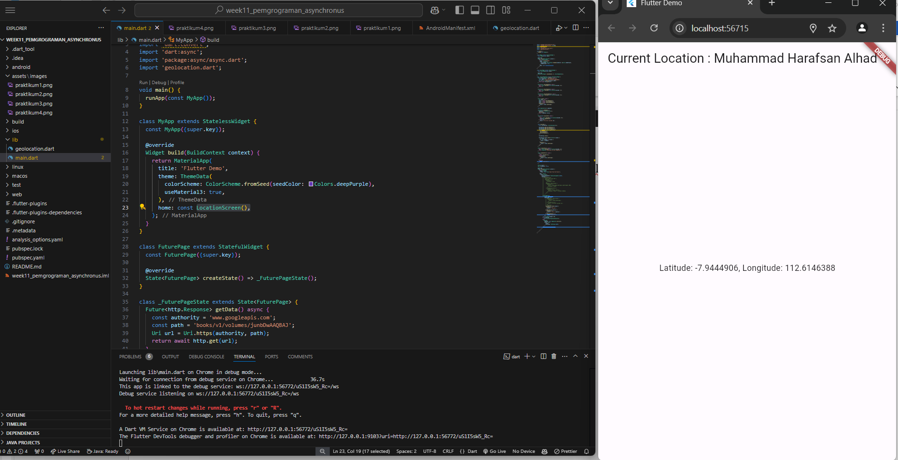

# Week 11 Pemrograman Asynchronous

Nama: Muhammad Harafsan Alhad
Kelas: TI-3C
NIM: 2241720059

## SS  Praktikum 1

## SS  Praktikum 2

## SS  Praktikum 3

## SS  Praktikum 4

## SS  Praktikum 5

## SS  Praktikum 6

## SS  Praktikum 7

## SS  Praktikum 8

Output Awal:

Kemudian: 

Kemudian; 

## SS  Praktikum 9

