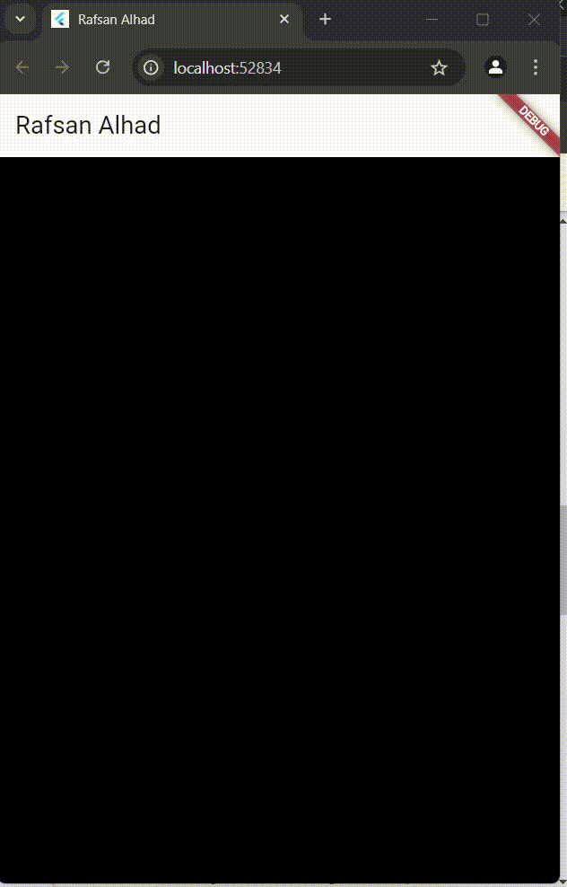
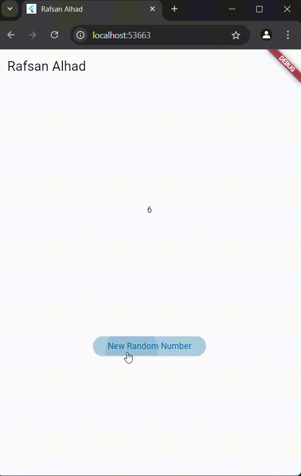
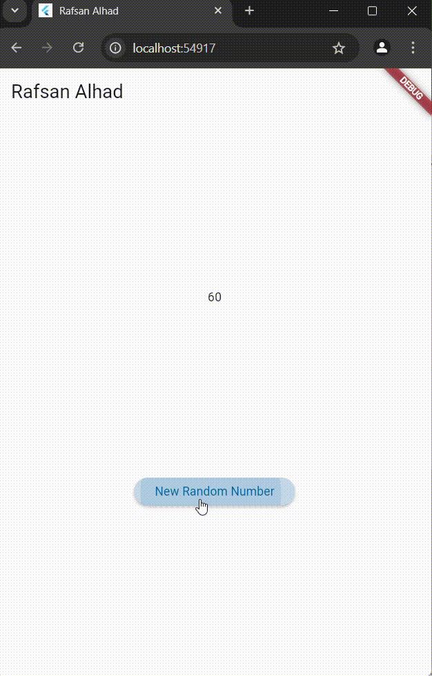
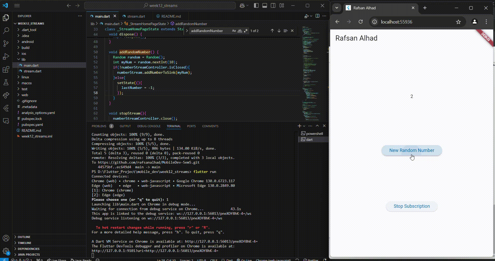
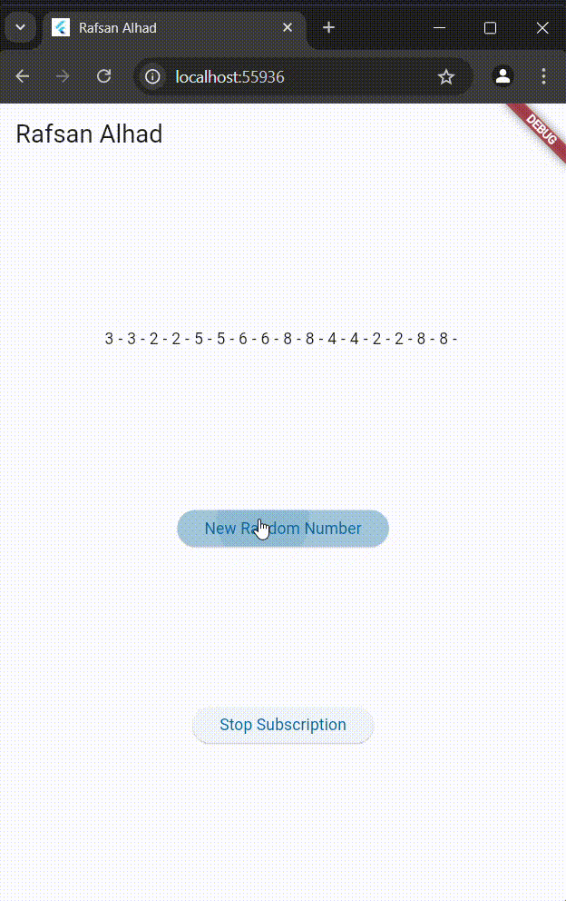
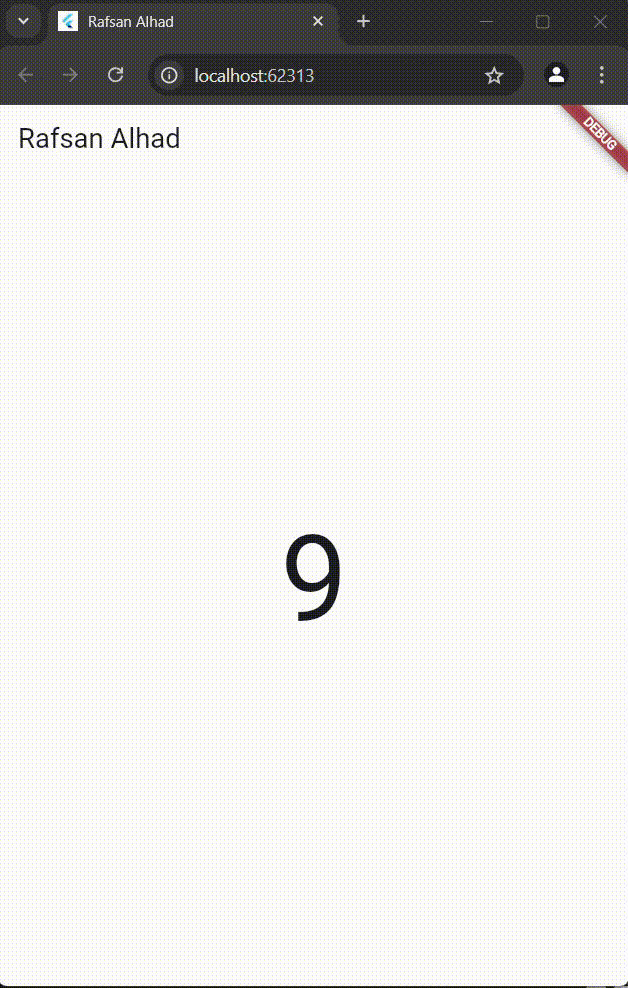

# week12_streams

Nama: Muhammad Harafsan Alhad  
Kelas: TI-3C  
NIM: 2241720059  

## Week 1 - Week 7 Practical Results

Pada praktikum ini, saya telah menyelesaikan praktikum 1 - 7. Setiap hasil praktikum ditampilkan dalam bentuk GIF untuk memudahkan pemahaman terhadap implementasi yang dilakukan.

### Praktikum 1 - Dart Streams

### Praktikum 2 - Stream controllers dan sinks

### Praktikum 3 - Injeksi data ke streams

### Praktikum 4 - Subscribe ke stream events

### Praktikum 5 - Multiple stream subscriptions

### Praktikum 6 - StreamBuilder

### Praktikum 7 - BLoC Pattern

## Getting Started

This project is a starting point for a Flutter application.

A few resources to get you started if this is your first Flutter project:

- [Lab: Write your first Flutter app](https://docs.flutter.dev/get-started/codelab)
- [Cookbook: Useful Flutter samples](https://docs.flutter.dev/cookbook)

For help getting started with Flutter development, view the
[online documentation](https://docs.flutter.dev/), which offers tutorials, samples, guidance on mobile development, and a full API reference.
