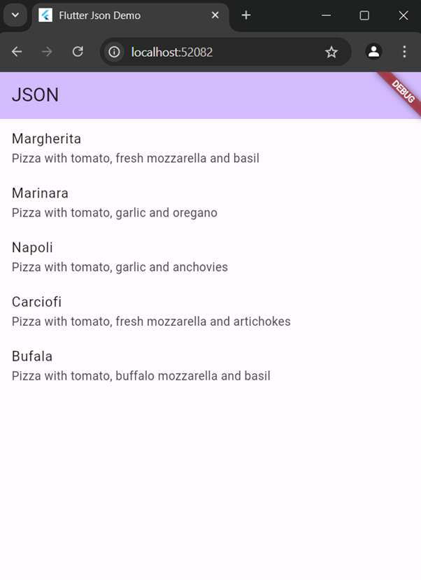
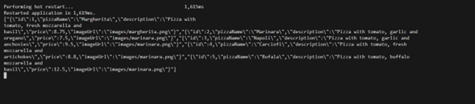
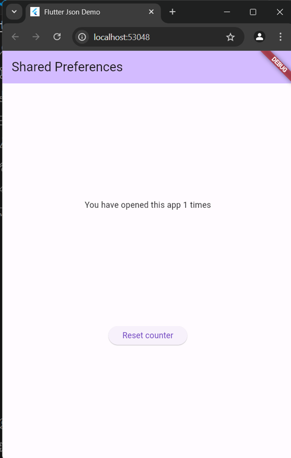
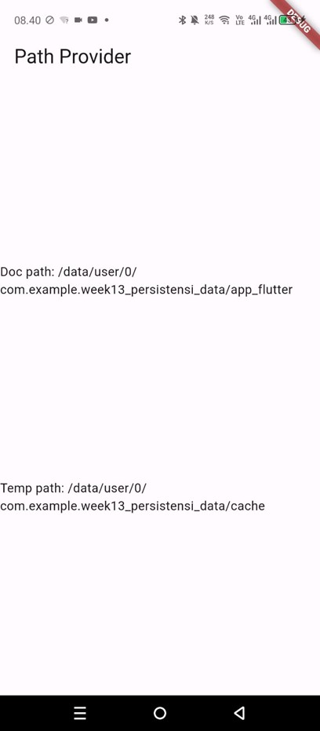
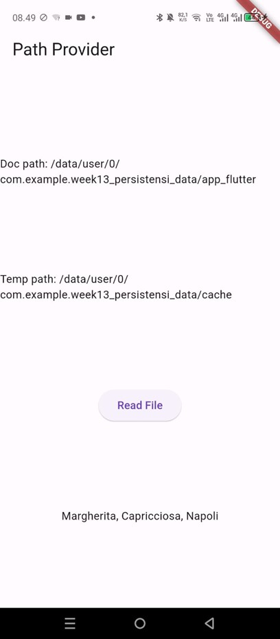
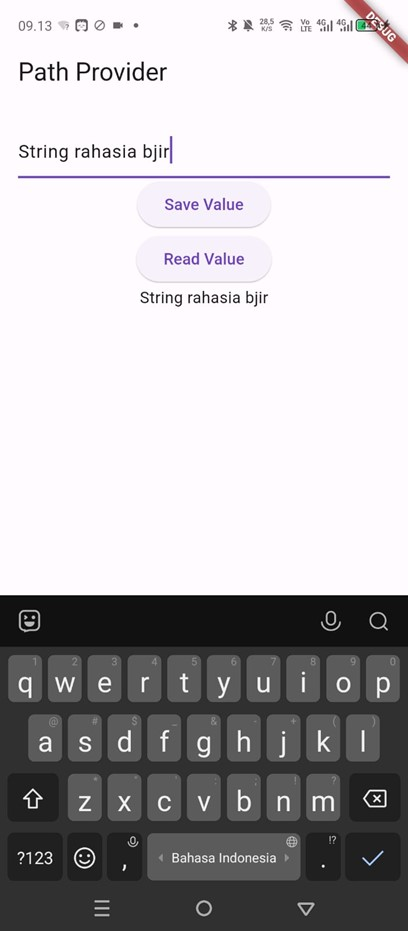

# week12_streams

Nama: Muhammad Harafsan Alhad  
Kelas: TI-3C  
NIM: 2241720059  

## Week 1 - Week 7 Practical Results

Pada praktikum ini, saya telah menyelesaikan praktikum 1 - 6.
### Praktikum 1 - Converting Dart models into JSON

### Praktikum 2 - Reading the JSON file

### Praktikum 3 - Saving data simply with SharedPreferences

### Praktikum 4 - Accessing the filesystem, part 1: path_provider

### Praktikum 5 - Accessing the filesystem, part 2: Working with directories

### Praktikum 6 - Praktikum 6: Using secure storage to store data

## Getting Started

This project is a starting point for a Flutter application.

A few resources to get you started if this is your first Flutter project:

- [Lab: Write your first Flutter app](https://docs.flutter.dev/get-started/codelab)
- [Cookbook: Useful Flutter samples](https://docs.flutter.dev/cookbook)

For help getting started with Flutter development, view the
[online documentation](https://docs.flutter.dev/), which offers tutorials, samples, guidance on mobile development, and a full API reference.
