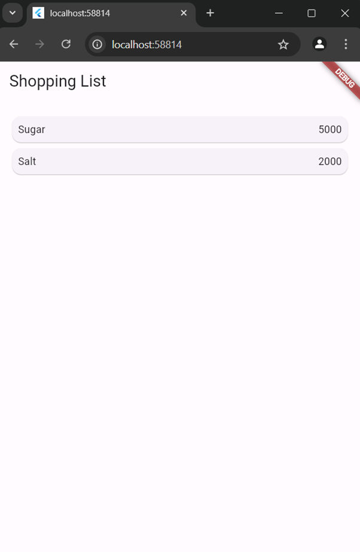
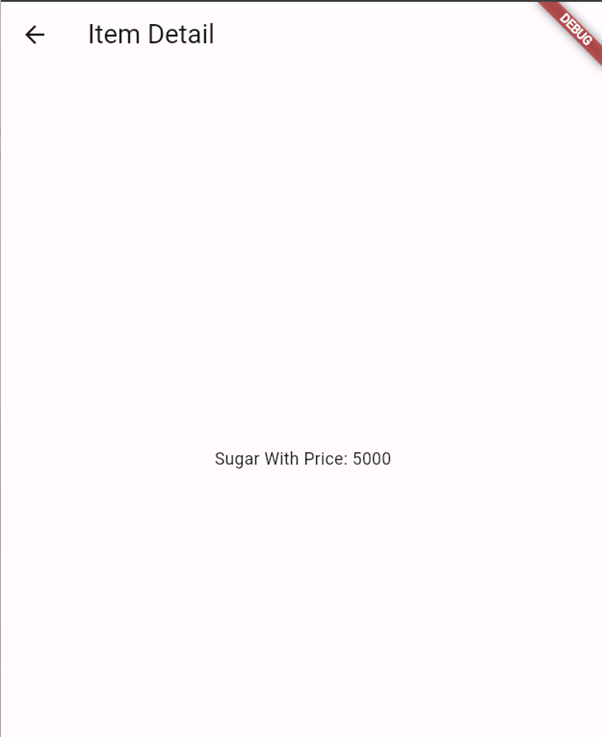
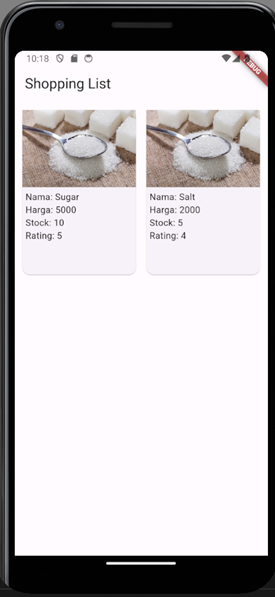
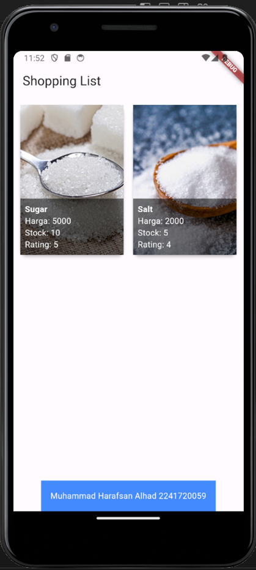
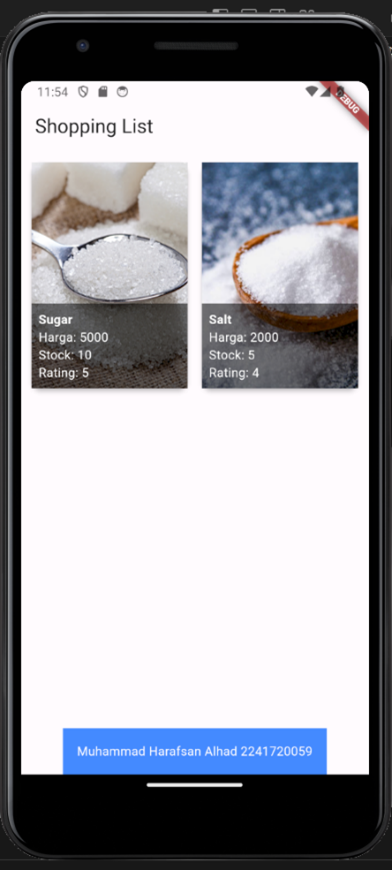
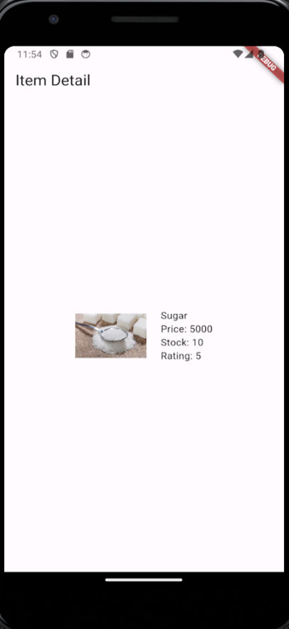

# week7_praktikum5

Muhammad Harafsan Alhad

Output Langkah 7: Menambahkan aksi pada ListView
Output Layout Langkah 7

Output Layout Langkah 7 Setelah Di Klik

Output Praktikum 2

Output Praktikum 2 Yang Sudah Diganti Layout dan Tambah Nama + NIM

Output Akhir: 

