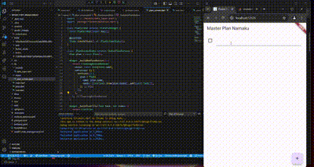
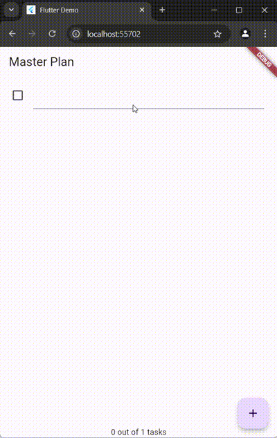
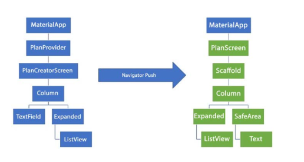

# Week 9 State Management

Nama: Muhammad Harafsan Alhad
Kelas: TI-3C
NIM: 2241720059

## Laporan  Praktikum 1
Tugas Praktikum 1: Dasar State dengan Model-View

1. Selesaikan langkah-langkah praktikum tersebut, lalu dokumentasikan berupa GIF hasil akhir praktikum beserta penjelasannya di file README.md! Jika Anda menemukan ada yang error atau tidak berjalan dengan baik, silakan diperbaiki.


2. Jelaskan maksud dari langkah 4 pada praktikum tersebut! Mengapa dilakukan demikian?

Jawaban: Langkah 4 pada praktikum tersebut bertujuan untuk menyederhanakan proses pengelolaan dan penggunaan model dalam aplikasi. Dengan membuat file data_layer.dart, kita dapat mengelompokkan beberapa model—dalam hal ini plan.dart dan task.dart—ke dalam satu file yang lebih ringkas.

3. Mengapa perlu variabel plan di langkah 6 pada praktikum tersebut? Mengapa dibuat konstanta ?

Jawaban: Variabel plan diperlukan untuk menyimpan dan mengelola data rencana dalam PlanScreen, sehingga memungkinkan akses ke atribut dan metode terkait rencana tersebut. Dengan menjadikannya sebagai konstanta (const Plan()), kita memastikan bahwa objek ini tidak akan berubah, menjaga konsistensi data selama siklus hidup tampilan. Hal ini juga memungkinkan Flutter untuk melakukan optimasi performa, seperti pengurangan penggunaan memori, karena sistem dapat mengenali bahwa objek tersebut statis. Selain itu, penggunaan konstanta meningkatkan keterbacaan kode, karena pengembang dapat dengan mudah memahami bahwa objek plan tidak akan mengalami perubahan, sehingga meningkatkan prediktabilitas aplikasi. Dengan demikian, mendeklarasikan plan sebagai konstanta berkontribusi pada integritas dan efisiensi keseluruhan aplikasi.

4. Lakukan capture hasil dari Langkah 9 berupa GIF, kemudian jelaskan apa yang telah Anda buat!

Jawaban:



Penjelasan: 
Setelah mengikuti Langkah 9, kita telah membuat widget _buildTaskTile, yang menampilkan setiap tugas dalam daftar rencana menggunakan ListTile. Widget ini menerima dua parameter: task, yang merupakan objek tugas, dan index, yang menunjukkan posisi tugas dalam daftar. Di dalamnya, kita menampilkan Checkbox untuk menunjukkan status penyelesaian tugas (task.complete), dan ketika pengguna mengubah statusnya, kita menggunakan setState untuk memperbarui objek plan dengan salinan daftar tugas yang telah dimodifikasi. Selain itu, terdapat TextFormField untuk mengedit deskripsi tugas; saat deskripsi diubah, kita juga memperbarui objek plan dengan cara yang sama. Dengan demikian, widget ini membuat tampilan daftar tugas interaktif dan responsif, memungkinkan pengguna untuk memperbarui status dan deskripsi tugas secara real-time dengan mudah.

5. Apa kegunaan method pada Langkah 11 dan 13 dalam lifecyle state ?

Jawaban:
Pada Langkah 11 dan 13, method yang ditambahkan berperan penting dalam manajemen siklus hidup state pada widget.

Langkah 11: initState()
Method initState() dipanggil sekali ketika widget di-inisialisasi. Di sini, kita mengatur scrollController dan menambahkan listener yang meminta fokus ke FocusNode kosong setiap kali pengguna menggulir. Ini berguna untuk menyembunyikan keyboard saat menggulir daftar, sehingga meningkatkan pengalaman pengguna, terutama saat berinteraksi dengan elemen input dalam daftar.

Langkah 13: dispose()
Method dispose() dipanggil ketika widget dihapus dari pohon widget. Di dalamnya, kita memanggil scrollController.dispose() untuk membersihkan sumber daya yang digunakan oleh scrollController, mencegah kebocoran memori. Ini memastikan bahwa semua listener dan kontrol terkait yang mungkin masih aktif akan dihapus, menjaga aplikasi tetap efisien dan responsif.

Secara keseluruhan, kedua method ini membantu dalam manajemen sumber daya dan perilaku widget saat berinteraksi dengan pengguna, yang sangat penting dalam menjaga performa aplikasi.

6. Kumpulkan laporan praktikum Anda berupa link commit atau repository GitHub ke spreadsheet yang telah disediakan!

## Laporan Praktikum 2
Tugas Praktikum 2: InheritedWidget

1. Selesaikan langkah-langkah praktikum tersebut, lalu dokumentasikan berupa GIF hasil akhir praktikum beserta penjelasannya di file README.md! Jika Anda menemukan ada yang error atau tidak berjalan dengan baik, silakan diperbaiki sesuai dengan tujuan aplikasi tersebut dibuat.



2. Jelaskan mana yang dimaksud InheritedWidget pada langkah 1 tersebut! Mengapa yang digunakan InheritedNotifier?

Jawaban: Pada langkah 1, InheritedWidget yang dimaksud adalah kelas dasar di Flutter yang memungkinkan data untuk di-share secara efisien di seluruh pohon widget. Dalam hal ini, PlanProvider adalah subclass dari InheritedNotifier<ValueNotifier<Plan>>, yang berarti ia tidak hanya berbagi data objek Plan, tetapi juga memantau perubahan data tersebut melalui ValueNotifier. InheritedNotifier dipilih karena menggabungkan fungsionalitas InheritedWidget dengan kemampuan untuk memberitahukan perubahan pada data yang dipegang oleh ValueNotifier. Dengan cara ini, setiap kali nilai dalam ValueNotifier<Plan> berubah, widget yang bergantung pada PlanProvider akan otomatis diperbarui. Ini sangat berguna untuk aplikasi yang memerlukan pembaruan real-time pada UI saat data berubah, seperti saat pengguna menambahkan atau memodifikasi rencana, sehingga memberikan cara yang efisien dan reaktif untuk mengelola dan menyebarkan data dalam aplikasi Flutter.

3. Jelaskan maksud dari method di langkah 3 pada praktikum tersebut! Mengapa dilakukan demikian?

Jawaban: 
Pada langkah 3, dua method yang ditambahkan ke dalam model class Plan berfungsi untuk memberikan informasi terkait status tugas dalam rencana. Method completedCount menghitung dan mengembalikan jumlah tugas yang telah diselesaikan (complete) dengan menyaring daftar tugas menggunakan where, sehingga memungkinkan pengguna untuk mengetahui berapa banyak tugas yang sudah selesai. Sementara itu, method completenessMessage menghasilkan string yang menunjukkan progres penyelesaian tugas, yaitu berapa banyak tugas yang telah diselesaikan dibandingkan dengan total tugas yang ada. Penambahan kedua method ini bertujuan untuk meningkatkan kemampuan aplikasi dalam memberikan informasi yang jelas dan ringkas kepada pengguna tentang progres mereka. Dengan cara ini, pengembang dapat dengan mudah memanggil method tersebut di berbagai tempat tanpa harus menulis logika penghitungan berulang kali, sekaligus menjaga kebersihan dan keterbacaan kode serta memudahkan pemeliharaan di masa depan.

4. Lakukan capture hasil dari Langkah 9 berupa GIF, kemudian jelaskan apa yang telah Anda buat!


Penjelasan:
Setelah menyelesaikan Langkah 9, widget SafeArea ditambahkan di bagian bawah tampilan untuk menampilkan completenessMessage, yang memberikan informasi mengenai progres penyelesaian tugas, seperti "3 out of 5 tasks completed". Penambahan ini meningkatkan pengalaman pengguna dengan memberikan umpan balik visual yang jelas tentang status rencana. Praktikum ini berfokus pada penggunaan InheritedWidget dan InheritedNotifier untuk mengelola data, memisahkan model dari tampilan, dan memungkinkan akses data yang efisien ke sub-widget tanpa perlu mengulang logika pengambilan data. Dengan menerapkan struktur ini, aplikasi dapat lebih mudah dikelola dan dipelihara, sekaligus mempertahankan keterbacaan kode, yang sangat penting dalam pengembangan aplikasi yang lebih kompleks.

5. Kumpulkan laporan praktikum Anda berupa link commit atau repository GitHub ke spreadsheet yang telah disediakan!


## Laporan Praktikum 3
Tugas Praktikum 3: State di Multiple Screens

1. Selesaikan langkah-langkah praktikum tersebut, lalu dokumentasikan berupa GIF hasil akhir praktikum beserta penjelasannya di file README.md! Jika Anda menemukan ada yang error atau tidak berjalan dengan baik, silakan diperbaiki sesuai dengan tujuan aplikasi tersebut dibuat.


2. Berdasarkan Praktikum 3 yang telah Anda lakukan, jelaskan maksud dari gambar diagram berikut ini!



Jawaban: 

Diagram Arsitektur Widget Tree Master Plan

Diagram tersebut menunjukkan arsitektur widget tree dan navigasi pada aplikasi Master Plan yang terdiri dari dua screen utama:

1. Sisi Kiri (Biru) - PlanCreatorScreen:

* MaterialApp sebagai root widget
* PlanProvider sebagai state management untuk menyimpan List<Plan>
* PlanCreatorScreen sebagai halaman utama yang berisi:
   * Column sebagai layout utama
   * TextField untuk input rencana baru
   * Expanded dengan ListView untuk menampilkan daftar plan

2. Sisi Kanan (Hijau) - PlanScreen:

* PlanScreen sebagai halaman detail yang menampilkan tasks dari sebuah plan
* Scaffold sebagai struktur dasar halaman  
* Column untuk layout yang berisi:
   * Expanded dengan ListView untuk daftar task
   * SafeArea dengan Text untuk menampilkan completeness message

Tanda panah "Navigator Push" di tengah menunjukkan navigasi dari PlanCreatorScreen ke PlanScreen ketika user mengetuk salah satu plan di ListView. Ini diimplementasikan menggunakan:

```dart
Navigator.of(context).push(
    MaterialPageRoute(builder: (_) => PlanScreen(plan: plan,))
);
```

Diagram ini mengilustrasikan konsep "Lift State Up" dimana PlanProvider ditempatkan di level atas (MaterialApp) sehingga state List<Plan> dapat diakses oleh kedua screen dan dikelola secara terpusat. Hal ini memungkinkan:
* Pembuatan plan baru di PlanCreatorScreen
* Pengeditan task di PlanScreen
* Sinkronisasi data antara kedua screen melalui PlanProvider

Struktur ini menerapkan manajemen state yang efisien untuk aplikasi dengan multiple screen sambil tetap menjaga konsistensi data di seluruh aplikasi.

3. Lakukan capture hasil dari Langkah 14 berupa GIF, kemudian jelaskan apa yang telah Anda buat!


Jawaban:
Setelah menyelesaikan Langkah 14, telah dibuat fungsi baru untuk menampilkan daftar rencana yang telah ditambahkan pengguna. Widget _buildMasterPlans() memeriksa apakah ada rencana dalam daftar dan, jika tidak, menampilkan pesan bahwa pengguna belum memiliki rencana. Jika ada, daftar rencana ditampilkan menggunakan ListView.builder, dengan setiap item menampilkan nama rencana dan pesan progres. Pengguna dapat mengetuk item untuk membuka layar detail rencana yang bersangkutan. Dengan demikian, aplikasi kini mendukung multiple screens dan memungkinkan pengguna untuk mengelola beberapa rencana secara bersamaan, menjadikan pengalaman lebih interaktif dan informatif. Ini menunjukkan penerapan konsep "Lift State Up" dengan baik, memudahkan pengelolaan state di seluruh aplikasi.

4. Kumpulkan laporan praktikum Anda berupa link commit atau repository GitHub ke spreadsheet yang telah disediakan!