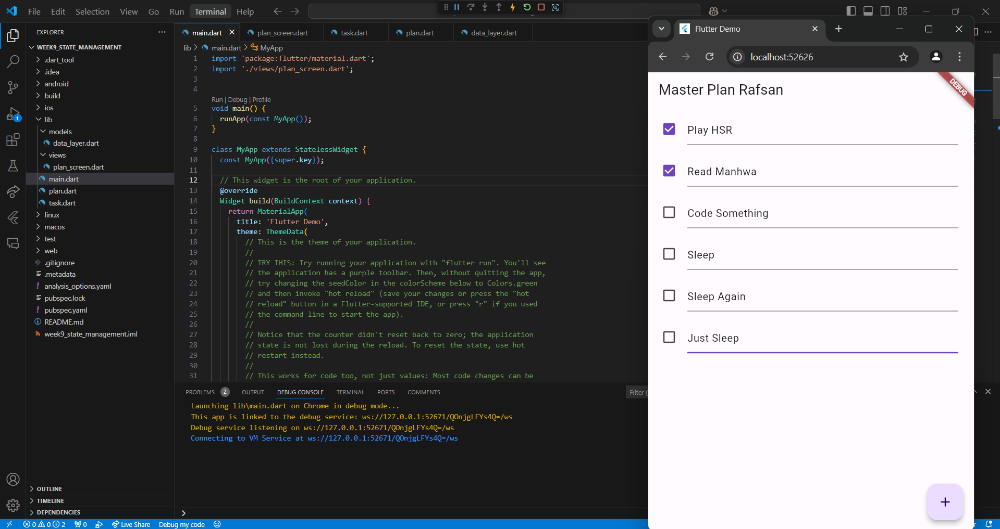

# Week 9 State Management Praktikum 1

Nama: Muhammad Harafsan Alhad
Kelas: TI-3C
NIM: 2241720059

## Laporan
Tugas Praktikum 1: Dasar State dengan Model-View

1. Selesaikan langkah-langkah praktikum tersebut, lalu dokumentasikan berupa GIF hasil akhir praktikum beserta penjelasannya di file README.md! Jika Anda menemukan ada yang error atau tidak berjalan dengan baik, silakan diperbaiki.

2. Jelaskan maksud dari langkah 4 pada praktikum tersebut! Mengapa dilakukan demikian?

Jawaban: Langkah 4 pada praktikum tersebut bertujuan untuk menyederhanakan proses pengelolaan dan penggunaan model dalam aplikasi. Dengan membuat file data_layer.dart, kita dapat mengelompokkan beberapa model—dalam hal ini plan.dart dan task.dart—ke dalam satu file yang lebih ringkas.

3. Mengapa perlu variabel plan di langkah 6 pada praktikum tersebut? Mengapa dibuat konstanta ?

Jawaban: Variabel plan diperlukan untuk menyimpan dan mengelola data rencana dalam PlanScreen, sehingga memungkinkan akses ke atribut dan metode terkait rencana tersebut. Dengan menjadikannya sebagai konstanta (const Plan()), kita memastikan bahwa objek ini tidak akan berubah, menjaga konsistensi data selama siklus hidup tampilan. Hal ini juga memungkinkan Flutter untuk melakukan optimasi performa, seperti pengurangan penggunaan memori, karena sistem dapat mengenali bahwa objek tersebut statis. Selain itu, penggunaan konstanta meningkatkan keterbacaan kode, karena pengembang dapat dengan mudah memahami bahwa objek plan tidak akan mengalami perubahan, sehingga meningkatkan prediktabilitas aplikasi. Dengan demikian, mendeklarasikan plan sebagai konstanta berkontribusi pada integritas dan efisiensi keseluruhan aplikasi.

4. Lakukan capture hasil dari Langkah 9 berupa GIF, kemudian jelaskan apa yang telah Anda buat!

Jawaban:

Penjelasan: 
Setelah mengikuti Langkah 9, kita telah membuat widget _buildTaskTile, yang menampilkan setiap tugas dalam daftar rencana menggunakan ListTile. Widget ini menerima dua parameter: task, yang merupakan objek tugas, dan index, yang menunjukkan posisi tugas dalam daftar. Di dalamnya, kita menampilkan Checkbox untuk menunjukkan status penyelesaian tugas (task.complete), dan ketika pengguna mengubah statusnya, kita menggunakan setState untuk memperbarui objek plan dengan salinan daftar tugas yang telah dimodifikasi. Selain itu, terdapat TextFormField untuk mengedit deskripsi tugas; saat deskripsi diubah, kita juga memperbarui objek plan dengan cara yang sama. Dengan demikian, widget ini membuat tampilan daftar tugas interaktif dan responsif, memungkinkan pengguna untuk memperbarui status dan deskripsi tugas secara real-time dengan mudah.

5. Apa kegunaan method pada Langkah 11 dan 13 dalam lifecyle state ?

Jawaban:
Pada Langkah 11 dan 13, method yang ditambahkan berperan penting dalam manajemen siklus hidup state pada widget.

Langkah 11: initState()
Method initState() dipanggil sekali ketika widget di-inisialisasi. Di sini, kita mengatur scrollController dan menambahkan listener yang meminta fokus ke FocusNode kosong setiap kali pengguna menggulir. Ini berguna untuk menyembunyikan keyboard saat menggulir daftar, sehingga meningkatkan pengalaman pengguna, terutama saat berinteraksi dengan elemen input dalam daftar.

Langkah 13: dispose()
Method dispose() dipanggil ketika widget dihapus dari pohon widget. Di dalamnya, kita memanggil scrollController.dispose() untuk membersihkan sumber daya yang digunakan oleh scrollController, mencegah kebocoran memori. Ini memastikan bahwa semua listener dan kontrol terkait yang mungkin masih aktif akan dihapus, menjaga aplikasi tetap efisien dan responsif.

Secara keseluruhan, kedua method ini membantu dalam manajemen sumber daya dan perilaku widget saat berinteraksi dengan pengguna, yang sangat penting dalam menjaga performa aplikasi.

6. Kumpulkan laporan praktikum Anda berupa link commit atau repository GitHub ke spreadsheet yang telah disediakan!